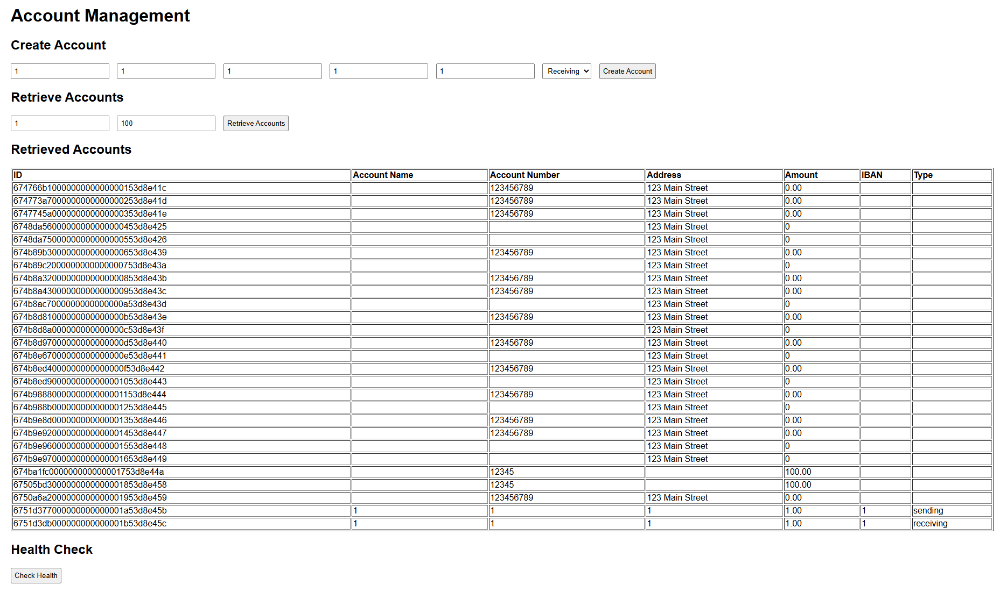

## Development Workflow

## Frontend

1. Use the following developer workflows in `Taskfile`

    ```text
    task
    ```

   Example output:

    ```text
    ==
    Tasks available 4 this infra KUBE.
    
    task: Available tasks for this project:
    * build:clean:          Clean up generated frontend files on Windows
    * build:compile:        Build the frontend WebAssembly binary on Windows
    * default:              List all commands defined.
   ```   

## UI

